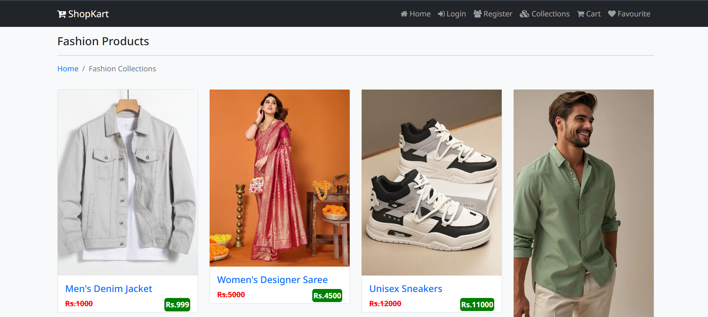

🛒 ShopKart – Django E-Commerce Website

An E-commerce web application built with Django, where users can browse products, add them to cart, mark favorites, and place orders.

🚀 Features

🔑 User Authentication – Register, login, logout (using Django auth).

🗂 Categories & Products – Organized product listings with images and descriptions.

❤️ Wishlist / Favourites – Users can save products they like.

🛍 Shopping Cart – Add products, update quantity, and calculate total cost.

📦 Order Management – Checkout flow (extendable for payments).

📸 Product Image Uploads – Images stored in uploads/.

📊 Admin Dashboard – Manage categories, products, and users.

🏗 Tech Stack

Backend: Django (Python)

Frontend: HTML, CSS, Bootstrap

Database: MySQL

Authentication: Django’s built-in User model

Deployment Ready: Can be hosted on Render, PythonAnywhere, or Railway

⚙️ Installation & Setup
1️⃣ Clone the Repository
git clone https://github.com//shopkart.git
cd shopkart

2️⃣ Create Virtual Environment
python -m venv env
source env/bin/activate   # On Mac/Linux
env\Scripts\activate      # On Windows

3️⃣ Install Dependencies
pip install -r requirements.txt

4️⃣ Apply Migrations
python manage.py migrate

5️⃣ Create Superuser (Admin)
python manage.py createsuperuser

6️⃣ Run Development Server
python manage.py runserver

App will be available at: http://127.0.0.1:8000/

📂 Project Structure
shopkart/
├── shop/                # Main app
│   ├── models.py        # Category, Product, Cart, Favourite
│   ├── views.py         # Business logic
│   ├── templates/       # HTML templates
│   └── urls.py          # App routes
├── media/uploads/       # Uploaded product/category images
├── manage.py            # Django CLI
├── requirements.txt     # Dependencies
└── db.sqlite3           # Database (SQLite)

🖼 Database Models
Category

name, image, description, status, created_at

Product

belongs to Category

name, vendor, product image, price, quantity, description, trending

Cart

linked to User & Product

product quantity

auto-calculates total cost

Favourite

linked to User & Product

🌍 Deployment

You can host this project for free:

Render
 – free modern hosting

PythonAnywhere
 – beginner friendly

Railway
 – free with PostgreSQL support

👨‍💻 Author

Developed by [vinith kabilar] as part of Django learning & portfolio building.

📧 Contact: vinithkabilar@gmail.com

<!-- 🔗 Portfolio: your-portfolio-link -->
## 🖼 Screenshots

### Homepage

### Product Page

### Categoires page

